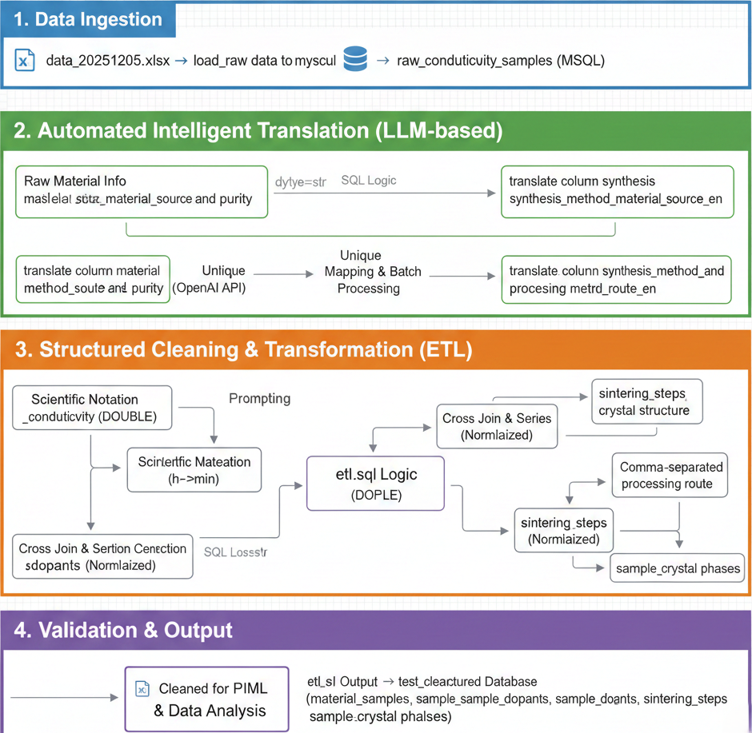

# Experimental Report on Data Cleaning for Zirconia Conductivity Data

## 1. Objective
This experiment aims to perform automated cleaning and standardization of raw research data on the electrical conductivity of zirconia-based materials. The objective is to construct a high-quality, structured database that addresses issues such as inconsistent formatting, unstructured descriptions, and non-uniform units present in the raw data, thereby providing a reliable data foundation for subsequent Physics-Informed Machine Learning (PIML) model training.

## 2. Experimental Environment
* **Programming Language**: Python 3.x
* **Database**: MySQL 8.0+
* **Core Libraries**: Pandas, SQLAlchemy, PyMySQL, LangChain (OpenAI API), python-dotenv
* **Data Source**: `data_20251205.xlsx` (containing raw literature-mined data)

## 3. Database Schema Design
To effectively store complex material properties, a relational database schema conforming to the Third Normal Form (3NF) was designed:

* **raw_conductivity_samples**: A raw data staging table. All fields are defined as `TEXT` type to ensure lossless import of any non-standard formats from Excel.
* **material_samples**: The core master table for cleaned data. It stores `sample_id`, references, and standardized physical quantities such as electrical conductivity and operating temperature.
* **sample_dopants**: A dopant element detail table. It resolves the "multiple values per row" problem by decomposing mixed dopants such as `Y/Sc/Dy` into separate rows, each containing ionic radius, valence state, and molar fraction.
* **sintering_steps**: A sintering step table. It stores multi-stage thermal processing procedures (e.g., "1400°C, 2h -> 1500°C, 4h").
* **sample_crystal_phases**: A crystal phase composition table. It associates samples with the `crystal_structure_dict` dictionary table, explicitly defining the crystallographic structure of materials (e.g., cubic phase, monoclinic phase).

## 4. Experimental Workflow and Implementation

### 4.1 Data Ingestion
The initial data loading was performed using the script `load_raw_data_to_mysql.py`.
* **Strategy**: The `dtype=str` parameter was enforced during reading to prevent precision loss or formatting errors caused by Pandas' automatic type inference.
* **Processing**: Empty cells in the Excel file were uniformly converted to empty strings to ensure complete data ingestion into the database.

### 4.2 Automated Intelligent Translation (LLM-based Translation)
A Large Language Model (LLM) was employed to standardize unstructured Chinese descriptions:
* **Raw Material Standardization**: The script `translate_column_material_source_and_purity.py` was executed, utilizing LangChain to invoke the OpenAI API, rewriting complex Chinese supplier and purity descriptions (e.g., "商品化材料(Toyo Soda)，>99%") into standardized academic English.
* **Processing Route Standardization**: The script `translate_column_synthesis_method_and_processing_route.py` was executed.
    * **Optimization Strategy**: A "extract unique values -> batch translate -> map back to database" strategy was adopted, significantly reducing token consumption.
    * **Concurrent Processing**: The `chain.batch` method was used to implement concurrent requests, improving processing efficiency.

### 4.3 Structured Cleaning and Transformation (ETL)
The core cleaning logic was implemented through the SQL script `etl.sql`, encompassing the following operations:
1.  **Numerical Cleaning**: `REGEXP_SUBSTR` regular expressions were used to extract temperature and time values from mixed-text fields.
2.  **Unit Standardization**: `CASE WHEN` logic was written to convert time values of different units (`h`, `min`) into a unified representation in minutes.
3.  **Scientific Notation Correction**: For conductivity fields, textual representations such as `×10` and `*10` were replaced with the standard `E` notation and subsequently converted to double-precision floating-point numbers (`DOUBLE`).
4.  **Dimensional Decomposition (Normalization)**:
    * SQL `CROSS JOIN` was used to generate numerical sequences in conjunction with the `SUBSTRING_INDEX` function, decomposing compound dopant information within a single row (e.g., `Y/Sc/Fe`) into multiple independent records inserted into the `sample_dopants` table.

### 4.4 Workflow Diagram
The following diagram provides a visual representation of the complete data cleaning workflow:

## 5. Result Validation
Sampling verification of the cleaning results was conducted by executing `test_clean_data.sql`:
* **Numerical Conversion**: Non-standard scientific notation formats such as `1.2×10^-2` were successfully identified and converted.
* **Null Value Cleaning**: Placeholder characters `/` in the raw data were correctly converted to database `NULL` values.
* **Structural Validation**: The multi-step sintering data for sample `sample_id=193` was successfully decomposed into multiple ordered records in the `sintering_steps` table.

## 6. Conclusion
This experiment successfully implemented a hybrid data cleaning pipeline combining "Python orchestration + LLM semantic enhancement + SQL logical processing." This approach effectively addresses the challenges prevalent in materials science data, including abundant unstructured text, high multi-component coupling complexity, and inconsistent formatting. The resulting structured database features well-defined fields and standardized data types, fully satisfying the requirements for subsequent machine learning modeling.
