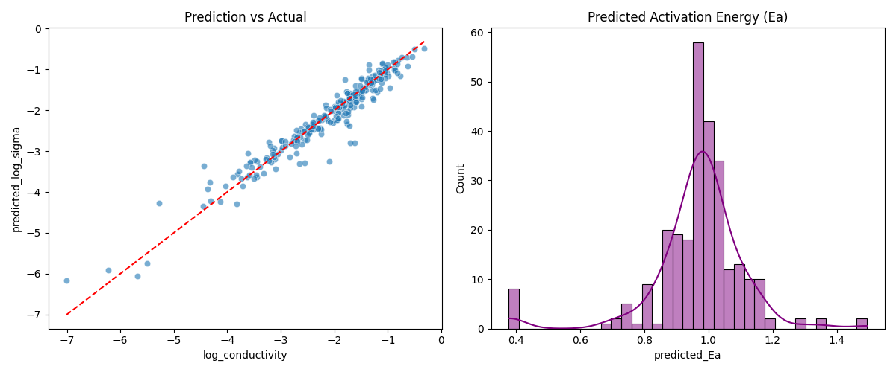

# 物理信息神经网络 (PIML) 材料电导率预测实验报告

## 1. 实验背景与目的
本实验旨在利用机器学习方法预测材料的电导率（Conductivity），并同时推断具有物理意义的参数（如活化能 $E_a$）。实验采用了**物理信息神经网络 (Physics-Informed Neural Network, PIML)** 架构，将 Arrhenius 物理定律作为约束层嵌入到深度学习模型中，以提高模型的泛化能力和可解释性。

## 2. 实验设置与方法

### 2.1 数据集
* **数据来源**：通过 `MaterialDataProcessor` 从本地 DuckDB 数据库中提取。
* **数据规模**：共加载样本 **1351** 个；ETL 输出 DataFrame 形状为 **(1351, 14)**（其中包含目标列 `log_conductivity`、温度列 `temperature_kelvin` 等非特征列）。
* **特征工程**：
    * **数值特征**：包括掺杂总分数、平均离子半径、平均化合价、掺杂数量、最大烧结温度、总烧结时间。
    * **分类特征**：合成方法、主要掺杂元素。
    * **文本特征**：材料来源与纯度（使用 TF-IDF 和 SVD 降维处理）。
* **模型输入维度说明**：输入到网络的特征为「6 个数值特征 + 2 个类别特征的 One-Hot 展开 + 文本特征的 SVD(16 维)」，因此最终维度应以实际 One-Hot 类别数为准（脚本中为 `X_train.shape[1]`），不等同于 DataFrame 的 14 列。
* **数据划分**：训练集与验证集比例为 8:2，随机种子设为 42。

### 2.2 模型架构
采用自定义的 `PhysicsInformedNet`，该模型包含两部分：
1.  **数据驱动编码器 (Encoder)**：通过多层感知机 (MLP) 从输入特征中提取隐含信息，分别预测两个物理参数：
    * **活化能 ($E_a$)**：通过 Softplus 激活函数保证为正值。
    * **前指因子 ($\log A$)**。
2.  **物理约束层 (Physics Layer)**：强制模型遵循 Arrhenius 方程计算最终的电导率预测值 $\log(\sigma)$：
    $$
    \log_{10}(\sigma) = \log_{10}(A) - \log_{10}(T) - \frac{E_a}{k_B \cdot T \cdot \ln(10)}
    $$
    其中 $k_B$ 为玻尔兹曼常数，$T$ 为绝对温度。

### 2.3 训练参数
* **优化器**：AdamW (Learning Rate = 1e-3, Weight Decay = 1e-4)。
* **损失函数**：均方误差损失 (MSELoss)。
* **迭代轮次**：300 Epochs。
* **Batch Size**：32。

## 3. 实验过程分析

根据训练日志 (`1.log`) 分析：
* **收敛情况**：模型训练迅速收敛。初始验证集 Loss 为 **3.0193**，在第 10 个 Epoch 时迅速下降至 **0.4678**。
* **稳定阶段**：约在第 60 个 Epoch 后，验证集 Loss 大致收敛在 **0.06 - 0.13** 区间波动，整体趋势稳定。
* **最佳模型**：在 Epoch 250 左右达到极优值（Loss $\approx$ 0.0659），随后模型在 0.065 - 0.085 之间波动；从验证集 Loss 变化看未出现明显反弹（脚本未记录训练集曲线，因此无法做严格的过拟合判定）。

## 4. 结果分析

### 4.1 定量评估
* **最终性能指标**：模型在验证集上的均方根误差 (**RMSE**) 为 **0.2532**，决定系数 **$R^2 \approx 0.9353$**。考虑到目标变量是 $\log_{10}$ 尺度的电导率，RMSE=0.2532 对应典型的倍数误差约为 $10^{0.2532}\approx 1.79$（即多数情况下在 **2 倍量级以内**），精度较高。

### 4.2 可视化分析
结合生成的分析图表：

1.  **预测值 vs 真实值 (Prediction vs Actual)**：
    * **左图分析**：散点紧密分布在红色虚线 ($y=x$) 附近。
    * **线性关系**：模型在图示取值范围内均表现出良好的线性相关性（$R^2 \approx 0.9353$）。
    * **误差分布**：在低电导率区间（-6 到 -7）存在少量离群点，但在高频区间（-1 到 -4）拟合效果极佳。

2.  **预测活化能分布 (Predicted Activation Energy $E_a$)**：
    * **右图分析**：模型反推的活化能 $E_a$ 呈现单峰分布，主要集中在 **约 1 eV** 的量级（以图为准）。
    * **合理性**：该量级与常见氧化物固体电解质（如氧化锆体系）报道的导电活化能范围相符，说明 PIML 模型在拟合电导率的同时输出了具有物理意义的中间参数。

## 5. 结论
1.  **模型有效性**：PIML 模型在小样本（1351条）数据下实现了较低的预测误差 (RMSE 0.2532)，验证了物理约束引入的有效性。
2.  **物理可解释性**：模型成功解耦了温度对电导率的影响，并输出了分布合理的活化能 ($E_a$) 参数，这使得模型不仅仅是一个"黑盒"，还能辅助研究人员分析材料的物理性质。
3.  **改进方向**：尽管整体拟合良好，但在极低电导率区域仍有改进空间，后续可尝试对低电导率样本进行过采样或调整损失函数权重。
