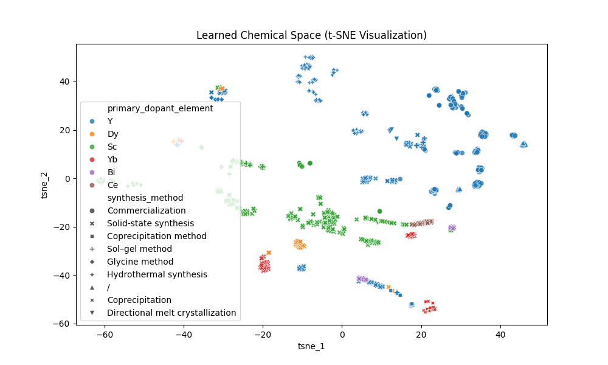
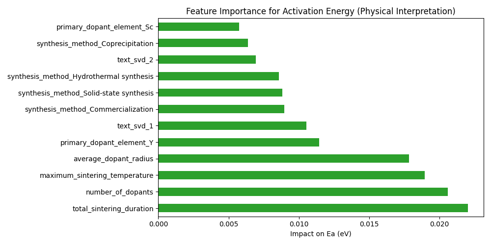
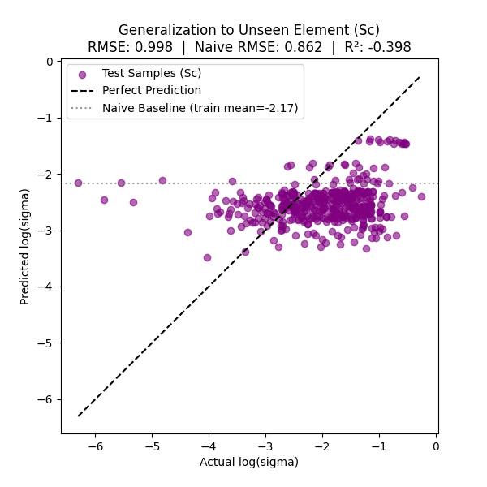

# Mechanism Analysis of Zirconia Conductivity Based on Physics-Informed Neural Networks

## 1. Experimental Background and Objectives
This experiment aims to conduct an in-depth analysis of the conductivity data of zirconia-based materials using the Physics-Informed Machine Learning (PIML) approach. Unlike traditional black-box models, this experiment embeds the Arrhenius physical law into the neural network architecture, not only to predict material performance but also to:
1.  **Visualize the Latent Space**: Investigate whether the model can automatically learn the chemical distribution patterns of materials.
2.  **Physical Attribution**: Explain the key physical and process factors influencing the activation energy ($E_a$).
3.  **Discover Unknown Materials**: Evaluate the model's generalization capability for predicting dopant elements not seen during training (e.g., scandium, Sc).

## 2. Experimental Methods

### 2.1 Data Processing and Feature Engineering
* **Data Source**: Experimental data were sourced from a DuckDB database, with SQL-based aggregation of dopant physical attributes (e.g., weighted average radius, average valence) and sintering process parameters.
* **Feature Preprocessing**: A hybrid processing pipeline was constructed, incorporating numerical standardization, One-Hot encoding of categorical variables, and TF-IDF/SVD dimensionality reduction of text features.

### 2.2 Model Architecture
A custom `PhysicsInformedNet` was adopted, comprising:
* **Encoder**: Maps high-dimensional material features to a low-dimensional latent space.
* **Physical Parameter Heads**: Separately predict the activation energy $E_a$ and the pre-exponential factor $\log A$.
* **Physics Constraint Layer**: Constrains the final conductivity prediction via the Arrhenius equation $\log(\sigma) = \log(A) - \log(T) - \frac{E_a}{k_B T \ln(10)}$, ensuring that results conform to thermodynamic laws.

---

## 3. Experimental Results and Analysis

### 3.1 Experiment 1: Material Chemical Latent Space Visualization (Latent Space Visualization)

* **Methodology**: The t-SNE algorithm was used to reduce the high-dimensional features extracted by the model's Encoder layer to a 2D plane.
* **Results**:

* **Analysis**:
    * **Chemical Clustering Trends**: As shown in the figure, data points generally exhibit a grouping trend according to "Primary Dopant" element. For instance, ytterbium (Yb, red points) and dysprosium (Dy, orange points) form relatively concentrated clusters, whereas yttrium (Y, blue points), having the largest sample size, covers a broader distribution with some degree of overlap and interleaving with elements such as scandium (Sc, green points).
    * **Model Learning Capability**: Although the cluster boundaries are not perfectly distinct, the model still captured chemical similarity trends from the raw features without any explicit chemical rules, with different dopant elements exhibiting discernible distribution differences in the latent space.
    * **Process Distribution**: Within a given dopant element group, points of different shapes (representing different synthesis methods, such as solid-state synthesis, coprecipitation, etc.) display a mixed distribution, though certain substructures are also observable, indicating that the synthesis process has a secondary influence on material properties.

### 3.2 Experiment 2: Physical Attribution Analysis of Activation Energy (Feature Importance for $E_a$)

* **Methodology**: Permutation importance analysis was performed on the network branch that predicts the activation energy $E_a$.
* **Results**:

* **Analysis**:
    * **Primary Influencing Factors**: `total_sintering_duration` (total sintering time) has the greatest impact on activation energy, followed by `number_of_dopants` (number of dopants) and `maximum_sintering_temperature` (maximum sintering temperature). This indicates that sintering process parameters (grain growth and densification processes) are critical for reducing grain boundary resistance and altering the overall activation energy.
    * **Physical Factors**: `average_dopant_radius` (average dopant radius) ranks fourth and remains an important physical feature. This is consistent with physical intuition, as lattice distortion caused by dopant ionic radius is one of the core factors affecting the oxygen ion migration barrier.
    * **Secondary Factors**: `primary_dopant_element_Y` (yttrium dopant indicator) and multiple One-Hot encoded variables for synthesis methods (`Commercialization`, `Solid-state synthesis`, `Hydrothermal synthesis`, `Coprecipitation`) also show notable importance, reflecting the combined influence of dopant element type and synthesis route on activation energy.

#### 3.2.1 Semantic Interpretation of Text Feature `text_svd`

In the above feature importance ranking, `text_svd_1` (ranked 6th) and `text_svd_2` (ranked 10th) are latent semantic components obtained by vectorizing the text field `material_source_and_purity` (raw material source and purity description) via TF-IDF and then performing Truncated SVD (TruncatedSVD, 16 dimensions) dimensionality reduction. To understand their physical meaning, we performed reverse analysis of the SVD component high-weight terms using the `inspect_text_svd.py` script. Key findings are as follows:

| Component | Positive High-Weight Terms | Negative High-Weight Terms | Semantic Interpretation |
|------|-------------|-------------|---------|
| `text_svd_1` | 99, supplied, no3, aladdin, shanghai, adamas | 200, nm, oxide, materials, zirconia, sc2o3 | **Reagent source and purity dimension**: The positive direction is associated with "high-purity chemical reagents + specific commercial suppliers (e.g., Shanghai Aladdin/Adamas)", while the negative direction is associated with "nano-oxide powder raw material descriptions". |
| `text_svd_2` | y2o3, sc2o3, zro2, materials, starting | oxide, zirconia, 200, nm, scandium, ytterbium | **Raw material chemical composition dimension**: The positive direction is associated with "starting materials identified by specific chemical formulas (Y₂O₃, Sc₂O₃, ZrO₂)", while the negative direction is associated with "raw materials described by common names (oxide, zirconia, scandium)". |

(Note: To enhance semantic interpretability, the word lists in the table above were filtered/sorted by semantic relevance among high-loading terms, potentially skipping generic words such as `used`. Therefore, they do not strictly correspond to results ranked by absolute loading values.)

* **Physical Significance**:
    * `text_svd_1` reveals the influence of **raw material quality and source** on activation energy — there are quantifiable differences in activation energy between samples prepared using high-purity reagent-grade raw materials (e.g., nitrate precursors) and those using commercial nano-oxide powders. This implies that raw material purity and morphology (solution precursors vs. powders) indirectly alter activation energy by affecting the microstructure during sintering (e.g., grain boundary impurity concentration, pore distribution).
    * `text_svd_2` captures **differences in raw material naming conventions** — papers using precise chemical formulas are often associated with specific experimental traditions and preparation refinement, and this semantic signal corresponds to systematic differences in activation energy.

#### 3.2.2 Overview of Semantic Themes Across All Text SVD Components

To further understand the role of text features in the model, we performed inverse term weight analysis on all **16 latent semantic components** (`text_svd_0` ~ `text_svd_15`) after TruncatedSVD dimensionality reduction. The components are categorized below into four major thematic clusters based on their primary semantic dimensions.

**Thematic Cluster A: Raw Material Purity and Reagent Source**

| Component | Positive High-Weight Terms | Negative High-Weight Terms | Semantic Interpretation |
|------|-------------|-------------|----------|
| `text_svd_0` | 99, used, materials, 200, nm, y2o3, oxide, supplied | — | **Baseline theme**: Captures the most prevalent terms in the corpus (purity indicator "99", common raw material keywords), serving as the average background of text descriptions. |
| `text_svd_1` | 99, supplied, no3, aladdin, shanghai, adamas | 200, nm, oxide, materials, zirconia, sc2o3 | **Reagent vs. powder dimension**: The positive direction is associated with high-purity chemical reagents + commercial suppliers (Aladdin/Adamas), while the negative direction is associated with nano-oxide powder raw materials. |
| `text_svd_9` | purity, china, yb2o3, geoquin, rare, earth, nano, farmeiya | commercial, japan, tokyo, tosoh, 8ysz, sc2o3 | **Domestic high-purity raw materials vs. Japanese commercial powders**: Distinguishes Chinese raw material suppliers (purity-oriented) from mature Japanese commercial products such as Tosoh. |

**Thematic Cluster B: Compound Nomenclature and Raw Material Specifications**

| Component | Positive High-Weight Terms | Negative High-Weight Terms | Semantic Interpretation |
|------|-------------|-------------|----------|
| `text_svd_2` | y2o3, sc2o3, zro2, materials, starting, zrocl2 | oxide, zirconia, 200, nm, scandium, ytterbium | **Chemical formula vs. common name**: Contrast between precise chemical formula identifiers (Y₂O₃, Sc₂O₃) and generic element/mineral names (oxide, scandium). |
| `text_svd_6` | scandia, powders, ceria, 200, nm, yttria | size, particle, powder, oxide, 6h2o, no3 | **Generic oxide names + nano-powders**: Associated with nano-scale powder products identified by common names ("scandia/ceria/yttria"). |
| `text_svd_8` | 6h2o, no3, sc2o3, zr, zro2, ce | zrocl2, starting, gd2o3, particle, size, powder | **Hydrated nitrate precursors vs. chloride precursors**: Distinguishes two categories of wet-chemical synthesis routes (nitrate sol-gel vs. zirconium oxychloride coprecipitation). |

**Thematic Cluster C: Powder Morphology, Processing Techniques, and Preparation Descriptions**

| Component | Positive High-Weight Terms | Negative High-Weight Terms | Semantic Interpretation |
|------|-------------|-------------|----------|
| `text_svd_3` | 110, tpo, tmpta, hdda, eda, byk, zirconia | powder, oxide, particle, size, scandium, purity | **Photocuring/additive manufacturing additives**: Associated with organic additive systems for 3D-printed ceramics, including photoinitiators (TPO), crosslinkers (TMPTA, HDDA), etc. |
| `text_svd_4` | powder, particle, size, purity, supplied, commercial | oxide, scandium, materials, starting, zrocl2, ytterbium | **Commercial powder quality description**: Captures commercial powder parameters described primarily in terms of particle size and purity. |
| `text_svd_5` | oxide, purity, supplied, commercial, material, scandium, japan, china | particle, size, no3, 200, nm, 6h2o, scandia, yttria | **Commercial oxide procurement vs. self-prepared nano-powder/solution routes**: Distinguishes the straightforward route of purchasing high-purity oxides from the more detailed routes requiring particle size/precursor descriptions. |
| `text_svd_11` | raw, ceria, scandia, zrocl2, materials, size, particle, yb2o3 | starting, powders, nm, 200, bi2o3, bismuth, zro2 | **"Raw materials" descriptive context**: Associated with papers using the "raw materials" narrative style. |
| `text_svd_12` | material, scsz, prepared, method, mixture, y2o3, house, mixed | supplied, materials, usa, sc2o3, commercial, raw, alfa, aesar | **Self-prepared materials vs. commercially purchased**: The positive direction is associated with "in-house prepared" materials, while the negative direction is associated with commercial sources such as "supplied by Alfa Aesar". |
| `text_svd_13` | raw, yttria, materials, scsz, nm, 200, method, prepared | mixture, ceria, scandia, zirconia, starting, ytterbium | **Self-prepared nano-powder description**: Associated with the narrative style describing self-prepared nanoscale raw materials. |
| `text_svd_15` | material, purity, scsz, obtained, raw, mixture, high, sputtering | prepared, method, house, mixed, fe2o3, coprecipitation, supplied, china | **Thin-film sputtering vs. wet-chemical coprecipitation**: Distinguishes dry processing methods such as sputtering from wet-chemical routes such as coprecipitation. |

**Thematic Cluster D: Geographic Region and Suppliers**

| Component | Positive High-Weight Terms | Negative High-Weight Terms | Semantic Interpretation |
|------|-------------|-------------|----------|
| `text_svd_7` | starting, commercial, 6h2o, zrocl2, no3, japan, tokyo | sc2o3, zro2, 99, shanghai, aladdin, adamas | **Japan vs. China suppliers**: The positive direction is associated with Japanese (Tokyo) commercial sources + wet-chemical precursors, while the negative direction is associated with Chinese (Shanghai) reagent suppliers. |
| `text_svd_10` | ceria, powder, scandia, purity, 99, alfa, aesar | powders, china, yb2o3, material, size, particle, japan, 8ysz | **Western suppliers vs. Asian suppliers**: Distinguishes Western brands such as Alfa Aesar (Thermo Fisher) from Chinese and Japanese raw material sources. |
| `text_svd_14` | y2o3, mixture, raw, supplied, kyoritsu, ceramic, bi2o3, ytterbium | purity, sc2o3, obtained, scsz, tokyo, starting, japan, ysz | **Japanese Kyoritsu ceramic raw materials**: Associated with a specific Japanese ceramic supplier and multi-element doping systems containing Bi₂O₃/Yb₂O₃. |

* **Comprehensive Discussion**:
    * **Four Semantic Dimensions**: The 16 SVD components can be summarized into four categories of latent semantics — (A) raw material purity and reagent grade, (B) compound naming conventions and specification notation, (C) powder morphology and preparation processes, and (D) geographic region/supplier sources. Together, these dimensions constitute a panoramic deconstruction of the `material_source_and_purity` text field.
    * **Physical Signals in Feature Importance**: The top-ranked text features in activation energy prediction — `text_svd_1` (6th) and `text_svd_2` (10th) — correspond to the most prominent contrast axes in Thematic Clusters A and B, respectively. This indicates that **reagent grade of raw materials** and **chemical formula identification standards** are the latent variables in the text information most relevant to activation energy. This reasonably reflects the physical mechanism by which raw material purity influences the ion migration barrier through its effect on grain boundary impurity concentration.
    * **Latent Encoding of Processing Routes**: Components such as `text_svd_3` (photocuring additives), `text_svd_8` (nitrate vs. chloride precursors), and `text_svd_15` (sputtering vs. coprecipitation) indicate that text features also indirectly encode **synthesis route differences**, which influence conductivity performance by determining the final microstructure (grain size, porosity, grain boundary phases).
    * **Statistical Significance of Geographic Signals**: The geographic/supplier dimensions in Thematic Cluster D may represent systematic experimental differences among different research groups (e.g., instrument calibration, measurement conditions), or may reflect latent differences in actual purity and particle characteristics across different commercial batches of raw materials.

### 3.3 Experiment 3: Zero-Shot Discovery Capability Test (Zero-Shot Discovery)

* **Methodology**: A "Leave-One-Dopant-Out" (LODO) approach was adopted, in which all scandium (Sc)-containing samples were completely excluded from the training set, and the model was trained using only other elements before predicting the performance of Sc-doped materials.
* **Results**:

* **Analysis**:
    * **Limited Prediction Accuracy**: With the Sc element completely unseen during training, the model's root mean square error (RMSE) on the test set was **0.9976**, a significant increase (approximately 4-fold) compared to the RMSE of approximately 0.253 under normal training conditions. This indicates a notable deficiency in the model's zero-shot generalization capability for completely unseen elements.
    * **Systematic Bias**: The scatter plot shows that the model exhibits **systematic underestimation** for samples in the high-conductivity region (Actual log(σ) > -2), with predictions compressed into a narrow band of -1.5 to -3, failing to adequately distinguish between different conductivity levels. This is because the conductivities of other dopant elements in the training set are generally lower than those of Sc, causing the model's learned prior distribution to be overly conservative.
    * **Positive Signals**: Despite the limited accuracy, the model did not produce entirely random predictions. From the scatter plot, it can be observed that predictions in the low-conductivity region (Actual log(σ) < -3) still roughly followed the variation trend, and the overall predicted distribution remained within a reasonable range rather than diverging. This suggests that the Arrhenius physics constraint layer played a role in cross-element knowledge transfer, enabling the model to produce physically plausible predictions even for unseen elements.
    * **Limitation Analysis**: Sc is known to be the optimal dopant element for zirconia-based systems in terms of conductivity. The exceptionally high match between the Sc³⁺ ionic radius (0.87 Å) and Zr⁴⁺ (0.84 Å) is a property that other training elements cannot replicate. Furthermore, Sc samples account for approximately 33% of the total dataset (442/1351), and their removal significantly reduces the training set, further increasing the difficulty of generalization.

---

## 4. Conclusions
This experiment successfully validated the effectiveness of the PIML model in materials science data analysis:
1.  The model is capable of **spontaneously learning** the chemical classification features of materials.
2.  The model can **correctly identify** the key process parameters (sintering time, sintering temperature) and physical parameters (ionic radius) that control ionic conductivity, demonstrating good interpretability.
3.  In the zero-shot cross-element generalization test, the model exhibited **preliminary transfer capability** (LODO-Sc RMSE = 0.998). The physics constraint layer enables predictions with reasonable trends; however, the accuracy remains significantly lower than under normal training conditions (RMSE ≈ 0.253), indicating substantial room for improvement in the model's generalization capability when facing elements completely absent from the training set.
