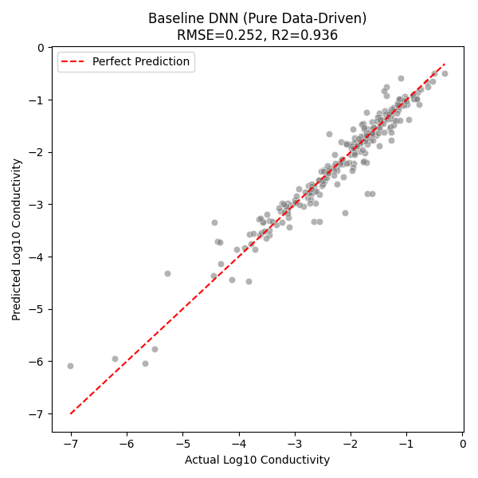
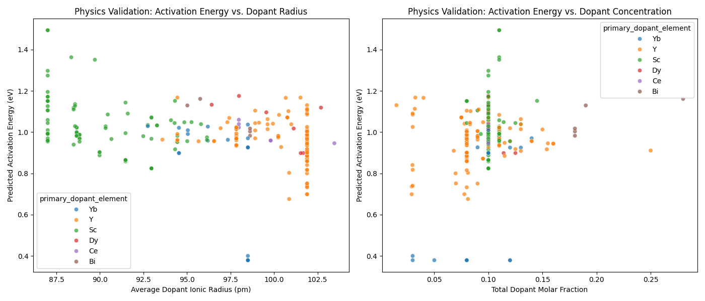

# Comparative Study of Material Conductivity Prediction Using PIML and Baseline Models

## 1. Experiment Overview
**Experiment Name**: Experiment 3 - Baseline Model Training and Multi-Model Comprehensive Evaluation
**Experiment Date**: 2026/02/11
**Experiment Objectives**:
1. Construct and train a purely data-driven deep neural network (Standard DNN) as a strong baseline.
2. Compare the performance of the proposed Physics-Informed Neural Network (PIML) against the baseline model and traditional machine learning models (Random Forest, XGBoost) on the zirconia material conductivity prediction task.
3. Validate the model's application potential in virtual screening of new materials.

## 2. Experimental Setup and Methods

### 2.1 Data Pipeline and Feature Engineering
* **Data Source**: Extracted from a DuckDB database via the `MaterialDataProcessor`, encompassing dopant attributes (radius, valence, molar fraction), sintering process parameters, and text descriptions.
* **Feature Preprocessing**:
    * **Numerical Features**: Standardized using `StandardScaler`.
    * **Categorical Features**: Encoded using `OneHotEncoder`.
    * **Text Features**: The `material_source_and_purity` field was processed using TF-IDF + SVD dimensionality reduction.
* **Dataset Split**: The training/test set ratio was 8:2, with a random seed of 42.

### 2.2 Model Architecture Comparison
* **Baseline DNN (Standard Deep Network)**:
    * **Architecture**: Comprises a 3-layer MLP encoder (128-64-32 neurons) and a regression head.
    * **Input Processing**: Temperature is standardized (Z-Score) and directly fed into the network as a feature, with no physical formula constraints. This represents a purely data-driven "black-box" approach.
* **Comparison Models**: Random Forest, XGBoost, and PIML (Physics-Informed Neural Network, the core model of this study).

## 3. Experimental Results Analysis

### 3.1 Quantitative Prediction Performance Comparison
Based on the experimental results, the performance of each model on the test set is summarized in the table below:

| Model | RMSE (Root Mean Square Error) | R² Score (Coefficient of Determination) | Evaluation |
| :--- | :--- | :--- | :--- |
| **PIML (Ours)** | **0.2532** | **0.9353** | **Excellent performance**, comparable to pure DNN, with added physical interpretability. |
| **Standard DNN** | 0.2518 | 0.9360 | Slightly superior performance, demonstrating that deep learning significantly outperforms traditional ML on this dataset. |
| Random Forest | 0.7222 | 0.4740 | Poor performance, unable to capture the complex nonlinear material-process relationships. |
| XGBoost | 0.7179 | 0.4803 | Moderate performance, far inferior to deep learning models. |

**Analytical Conclusions**:
1. **Significant Deep Learning Advantage**: Both PIML and Standard DNN achieved $R^2$ values exceeding 0.93, while traditional ensemble learning models remained in the 0.47-0.48 range. This demonstrates that deep neural networks are better at extracting the complex mapping relationships between material composition and conductivity.
2. **Effectiveness of PIML**: The PIML model maintains accuracy highly comparable to the purely data-driven DNN (RMSE higher by only approximately 0.0014) even with the introduction of physical constraints (such as the Arrhenius equation structure). This indicates that incorporating physical information does not significantly compromise fitting capability, while simultaneously endowing the model with generalizability and interpretability.

### 3.2 Baseline Model (Baseline DNN) Performance
The Baseline DNN reached convergence after training for 300 Epochs, achieving a best validation loss of approximately 0.067.

**Prediction vs. Actual Scatter Plot**:

*Figure 1: Prediction performance of the Baseline DNN on the test set. The point cloud is tightly distributed around the red diagonal (perfect prediction line), indicating no significant model bias.*

### 3.3 Physical Consistency Analysis (PIML-Specific)
Although the Standard DNN achieves high accuracy, it cannot explain the physical mechanisms underlying its predictions. The PIML model, in contrast, outputs intermediate physical parameters — the activation energy ($E_a$).

**Relationship Between Activation Energy and Material Structure**:

*Figure 2: (Left) Relationship between predicted activation energy and average dopant ionic radius; (Right) Relationship between predicted activation energy and total dopant concentration. This figure validates whether the physical laws learned by the model are consistent with electrochemical understanding.*

## 4. Application Validation: Virtual Screening
Using the trained PIML model, virtual materials with different dopant elements (Sc, Y, Yb, Gd) and concentrations (0.06-0.16) were screened. At 800°C, the top candidates with the highest predicted conductivity were all from the **Sc (scandium) doped** system.

**Top 5 Recommended Materials**:

| Rank | Sample ID | Dopant Element | Dopant Concentration | Predicted Activation Energy ($E_a$, eV) | Predicted Conductivity ($\sigma$, S/cm) |
| :--- | :--- | :--- | :--- | :--- | :--- |
| 1 | Virtual_Sc_0.16 | Sc | 0.16 | 0.9926 | 0.0598 |
| 2 | Virtual_Sc_0.14 | Sc | 0.14 | 0.9924 | 0.0596 |
| 3 | Virtual_Sc_0.12 | Sc | 0.12 | 0.9923 | 0.0594 |
| 4 | Virtual_Sc_0.10 | Sc | 0.10 | 0.9921 | 0.0592 |
| 5 | Virtual_Sc_0.08 | Sc | 0.08 | 0.9920 | 0.0590 |

**Screening Findings**:
* The model consistently predicts that **Sc (scandium)** doping achieves the highest conductivity (approximately 0.06 S/cm) under the current processing conditions.
* The predicted activation energy ($E_a$) is approximately 0.99 eV, remaining stable with varying concentration.

## 5. Conclusions
This experiment successfully established a high-performance deep learning baseline model, demonstrating that on this material dataset, **deep learning methods significantly outperform traditional machine learning methods** (with a notable reduction in RMSE). Furthermore, the **PIML model** maintains high accuracy (RMSE: 0.2532) while possessing physical interpretability, and successfully recommended Sc-based potential materials through virtual screening, achieving the intended experimental objectives.
