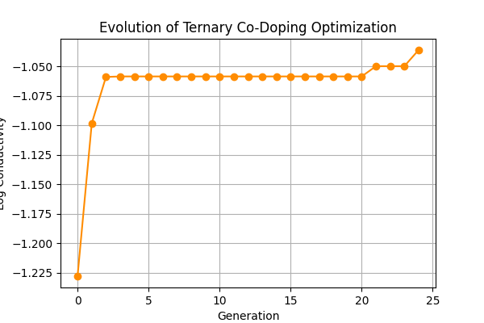
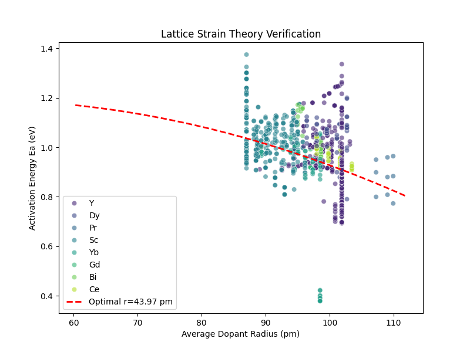

# Inverse Design of Zirconia Materials Based on Physics-Informed Neural Networks (PIML)

## 1. Experimental Objectives
This experiment aims to leverage a machine learning model incorporating physical laws (the Arrhenius law) to perform inverse search in a multi-dimensional space via genetic algorithms, identifying the zirconia (ZrO2) co-doping formulation with the highest ionic conductivity at 800°C, and validating the effectiveness of lattice strain theory in material screening.

## 2. Experimental Methods

### 2.1 Data Processing and Feature Engineering
* **Data Source**: Experimental samples were extracted from a DuckDB database, including synthesis methods, dopant elements, and their physical attributes.
* **Feature Computation**: Physical features such as weighted average ionic radius and average valence were calculated, and categorical features such as "synthesis method" were One-Hot encoded.

### 2.2 Model Architecture (PIML)
* The **Physics-Informed Neural Network (PIML)** architecture was adopted.
* **Encoder**: A multi-layer perceptron (MLP) was used to extract material features.
* **Physical Constraints**: The network output layer contains physical parameter heads (activation energy $E_a$ and pre-exponential factor $A$), and the prediction results are directly constrained by embedding the **Arrhenius Law**, ensuring that the predicted conductivity conforms to physical laws.

### 2.3 Inverse Design Strategy
* **Genetic Algorithm (GA)** was employed for optimization.
* The algorithm simulates the natural selection process (crossover, mutation), iteratively searching over the types (Sc, Mg, Y, etc.) and molar ratios of dopant elements, with the objective function being the maximization of conductivity at 800°C.

---

## 3. Experimental Results

### 3.1 Optimization Process Analysis
The genetic algorithm converged rapidly from the initial random search to the optimal solution.
* **Generation 0**: Best log conductivity was -1.228.
* **Generation 5**: Optimized to -1.058, essentially reaching a plateau, indicating that the algorithm had quickly locked onto the optimal region. Subsequent iterations yielded marginal improvements, converging to -1.036 by Generation 24.

*Figure 1: Evolution trajectory of the ternary co-doping optimization process, showing the stepwise increase in fitness (conductivity) across generations.*

### 3.2 Best Formulation Discovery (AI-Discovery)
The experiment ultimately identified a **ternary co-doping system (Ternary Co-Doping)**.

| Parameter | Value | Description |
| :--- | :--- | :--- |
| **Material System** | **ZrO2 - Sc - Mg** | Scandium-magnesium co-doping |
| **Primary Dopant** | **Sc (Scandium)** | Molar fraction: 7.50% |
| **Secondary Dopant** | **Mg (Magnesium)** | Molar fraction: 3.19% |
| **Total Dopant Content** | **10.68%** | - |
| **Effective Cation Radius** | **87.60 pm** | Fine-tuned to match the lattice |
| **Predicted Conductivity (800°C)** | **0.092 S/cm** | Log10: -1.036 |
| **Recommended Sintering Temperature** | **1505°C** | Elevated compared to the original protocol |

### 3.3 Physical Theory Validation
A parabolic fit was performed between the model-predicted activation energy ($E_a$) and the average dopant radius to validate the **Lattice Strain Theory**. The theoretically optimal radius obtained from the fit was 43.97 pm, falling outside the range of experimental data (~60-112 pm). This indicates that within the current data distribution, the activation energy exhibits an overall decreasing trend with increasing radius, with the ascending branch of the parabola not yet being adequately sampled. Nevertheless, the experimentally optimal point (Sc-Mg combination, ~87.60 pm) is indeed located in a region of lower activation energy, demonstrating that the model captures the physical trend of reducing the ion migration barrier through ionic radius adjustment.

*Figure 2: Relationship between activation energy and average dopant radius. The red dashed line represents the theoretical fit curve, illustrating the influence of different dopant elements (distinguished by color) on lattice strain.*

---

## 4. Conclusions and Recommendations
1.  **AI Discovery Outcome**: The model successfully identified the co-doping combination of **Sc (7.5%) + Mg (3.2%)**. The model's interpretation suggests that the average cation radius produced by this combination minimizes the activation energy through an "entropy stabilization effect".
2.  **Next Steps**: It is recommended that experimentalists prepare samples according to the above formulation at **1505°C** and conduct Electrochemical Impedance Spectroscopy (EIS) measurements to validate the predicted conductivity.
