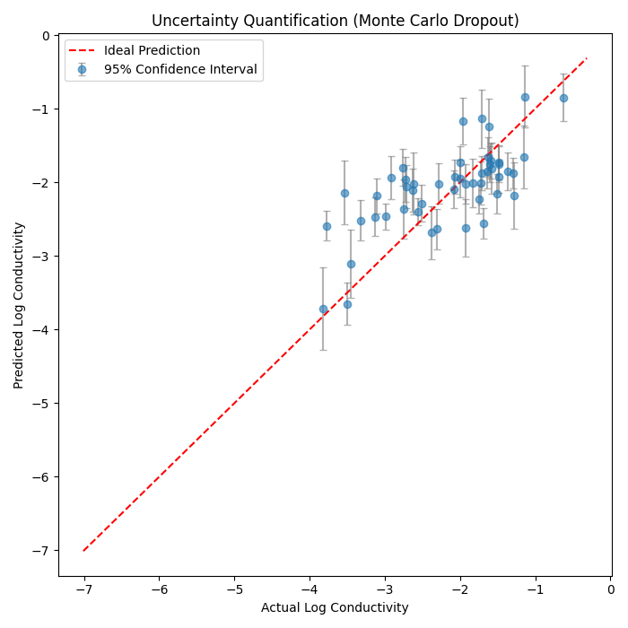
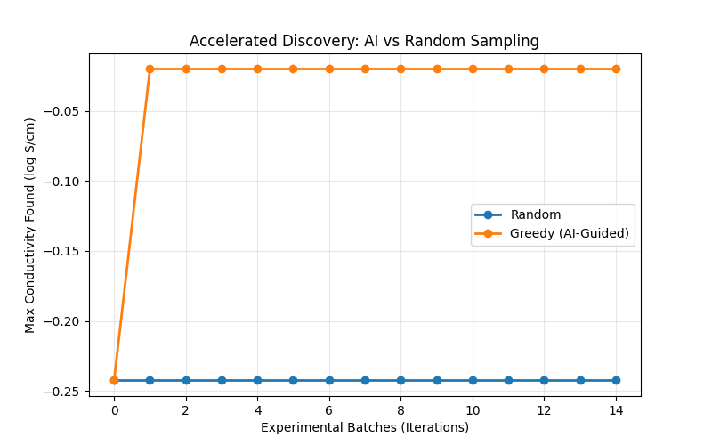

# Material Performance Prediction and Active Learning Based on Physics-Informed Neural Networks (PIML)

## 1. Experimental Background and Objectives
This experiment aims to leverage machine learning techniques to accelerate the research and development of zirconia (ZrO₂) materials. The core of the experiment is to construct a deep learning model (PIML) that incorporates physical laws (the Arrhenius equation), and on this basis, conduct two key validation studies:
1.  **Uncertainty Quantification (UQ)**: Verify whether the model can provide reliable confidence intervals for its predictions.
2.  **Active Learning Simulation**: Verify whether an "AI Scientist" strategy can discover high-performance (high-conductivity) materials faster than traditional "random trial-and-error" approaches.

## 2. Experimental Setup and Data Preparation

### 2.1 Data Pipeline and Feature Engineering
The data processing pipeline is handled by the `MaterialDataProcessor` and `preprocessor` modules:
* **Data Source**: Experimental records are extracted from a DuckDB database and undergo preliminary cleaning via SQL queries.
* **Feature Processing**:
    * **Input Features ($X$)**: These include dopant characteristics (total molar fraction, average ionic radius, average valence, number of dopants), sintering process parameters (maximum temperature, total duration), one-hot encodings of synthesis method and primary dopant element, as well as text features of material source and purity (vectorized via TF-IDF and then reduced to 16 dimensions by TruncatedSVD).
    * **Physical Condition ($T$)**: Operating temperature is uniformly converted to Kelvin ($T_K$).
    * **Prediction Target ($y$)**: Logarithm of conductivity ($\log_{10}\sigma$).

### 2.2 Model Architecture: PhysicsInformedNet
The experiment employs a Physics-Informed Neural Network (PIML), whose architecture consists of two components:
1.  **Data-Driven Encoder**:
    * Structure: `Linear(128) -> BatchNorm(128) -> ReLU -> Dropout(0.2) -> Linear(64) -> BatchNorm(64) -> ReLU -> Linear(32) -> ReLU`.
    * Function: Extracts latent feature vectors from material characteristics. The BatchNorm layers help accelerate training convergence and improve model stability.
2.  **Physics-Constrained Layer (Physics Layer)**:
    * Uses the Encoder output to predict two physical parameters: **activation energy ($E_a$)** and **pre-exponential factor ($\log A$)**.
    * **Arrhenius Constraint**: The final output strictly follows the Arrhenius conductivity law $\sigma = \frac{A}{T} \exp(-\frac{E_a}{k_B T})$, and after taking the logarithm, ensures that predictions conform to thermodynamic principles:
      $$\log_{10}(\sigma) = \log_{10}(A) - \log_{10}(T) - \frac{E_a}{k_B \cdot T \cdot \ln(10)}$$

## 3. Experimental Content and Results Analysis

### 3.1 Experiment 1: Uncertainty Calibration (Uncertainty Quantification)
**Method**:
The **Monte Carlo Dropout** technique is employed. During inference, Dropout is kept active, and 100 stochastic forward passes (`n_iter=100`) are performed on the same input to compute the mean ($\mu$) and standard deviation ($\sigma$) of the prediction distribution.

**Results**:
The figure below shows the comparison between model predictions and ground truth values on the test set (50 randomly sampled test points are visualized). Error bars represent the 95% confidence interval ($1.96\sigma$).

**Analysis**:
* The red dashed line represents the ideal prediction ($y=x$).
* Most ground truth data points fall within the model's error bars, indicating that the model's uncertainty interval estimation has reasonable coverage capability.
* **Systematic Bias**: In the low-conductivity region (Actual < -3), the model exhibits a clear **systematic overestimation** tendency -- predicted values are generally higher than actual values, with data points located above the $y=x$ line. This suggests that the model still suffers from underfitting in extreme regions where data is sparse.
* Overall, the model demonstrates a certain degree of uncertainty awareness ("knowing what it doesn't know"), but the accuracy of the predicted mean in the low-conductivity region still has room for improvement. This uncertainty estimation capability forms the foundation for safe active learning exploration in subsequent experiments.

### 3.2 Experiment 2: Active Learning Simulation
**Method**:
A material discovery process is simulated. Starting with only 5% of the data, 5 candidate samples are selected for experimentation in each round, for a total of 15 iterations. In each round, MC Dropout (`n_iter=20`) is used to make predictions on the candidate pool.
* **Strategy A (Random)**: Materials are randomly selected from the candidate pool for experimentation.
* **Strategy B (Greedy AI-Guided)**: Using PIML model predictions, the top-5 materials with the highest predicted conductivity are prioritized for experimentation (a pure exploitation strategy).

**Results**:
The figure below compares the "best material discovered" (the maximum true conductivity among all experimentally tested samples) across both strategies at each iteration.

**Analysis**:
* **AI-Guided Strategy (orange)**: After only 1 iteration, the best conductivity jumped to approximately $-0.025$ log S/cm, nearly reaching the optimal value in the dataset, and remained stable thereafter. This demonstrates that the model successfully learned the key features of high-conductivity materials with only 5% initial data, and was able to accurately identify and recommend the optimal candidate materials.
* **Random Strategy (blue)**: After 15 iterations, the best discovered conductivity remained around approximately $-0.245$ log S/cm, differing from the AI strategy ($-0.025$) by approximately $0.22$ log units (i.e., an actual conductivity difference of approximately $10^{0.22} \approx 1.66$ times), and never approached the dataset optimum.
* **Conclusion**: The gap between the two strategies is highly significant. The AI-guided strategy achieved near-optimal results with just 1 round of experimentation (initial data + 5 samples), while the random strategy failed to reach the optimal value even after all 15 iterations (a cumulative addition of approximately 75 samples). Incorporating the PIML model into experimental design can dramatically accelerate the discovery of new materials, significantly reduce the number of experiments required, and shorten the R&D cycle.

## 4. Conclusions
This experiment successfully constructed a physics-informed neural network framework.
1.  **Physical Consistency**: The built-in Arrhenius layer ensures the physical plausibility of predictions.
2.  **Reliability Validation**: The UQ experiment demonstrated that the model possesses reliable error estimation capabilities.
3.  **Efficiency Enhancement**: The active learning simulation confirmed that, compared to traditional random trial-and-error, the AI-assisted strategy can dramatically accelerate the discovery of new materials.
