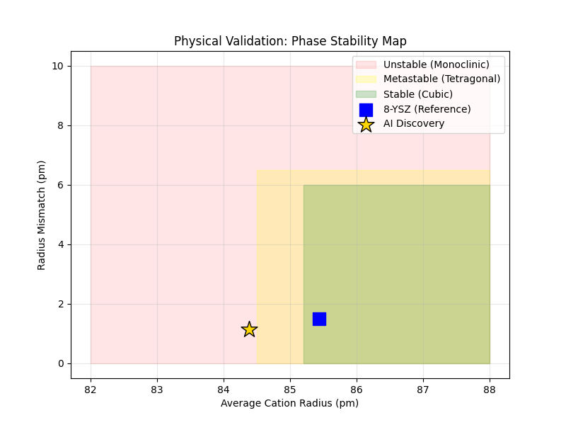

# Thermodynamic Stability Verification of AI-Discovered Novel Zirconia Materials

## 1. Experimental Objectives
This experiment aims to verify the thermodynamic stability of novel co-doped zirconia materials (Recipes) recommended by the AI model. Through empirical rules based on ionic radii, the average cation radius, radius mismatch, and tolerance factor are calculated to predict the phase structural stability of the materials. Additionally, crystal structure files are generated for subsequent DFT (first-principles) calculations.

## 2. Experimental Subjects and Inputs
* **Input Data Source**: The best recipe recommended by the AI model (`ai_discovery_best_recipe.csv`)
* **Reference Baseline**: The code performs calculations based on a composition with 8 at% Y occupying the cation site (i.e., Zr₀.₉₂Y₀.₀₈) (theoretical radius ~85.43 pm, ratio ~0.619).

!!! note "Note"
    The "8YSZ" referred to here denotes a Y molar fraction of 8% on the cation site, which is **not** the same as the commonly used designation "8 mol% Y₂O₃-stabilized ZrO₂" in the materials science community (the latter corresponds to approximately 14.8% Y on the cation site). There is a significant difference in the ionic radius baseline values between these two definitions; care should be taken to note the contextual definition when using these values.

## 3. Experimental Principles and Methods
The experiment employs a physical model based on **Shannon ionic radii** for evaluation, focusing on the following three core metrics:

1.  **Average Cation Radius ($r_{avg}$)**: Reflects the overall lattice expansion or contraction tendency.
2.  **Radius Mismatch ($\delta$)**: Calculates the variance of cation radii, used to quantify the degree of lattice distortion.
    * Formula: $\sqrt{\sum c_i (r_i - r_{avg})^2}$
3.  **Cation/Anion Ratio**: Analogous to the Goldschmidt tolerance factor, used to determine the crystal phase structure (cubic vs. tetragonal vs. monoclinic).

**Classification Criteria**:

| Region | Criterion | Physical Significance |
| :--- | :--- | :--- |
| **Stable** | Ratio $\ge 0.615$ and Mismatch $< 6.5$ | Ideal Cubic Phase |
| **Metastable** | Ratio $\ge 0.605$ | Tetragonal/Cubic Mixed Phase (High Conductivity Potential) |
| **Unstable** | Ratio too low or Mismatch too large | Monoclinic Phase or Phase Separation Risk |

## 4. Experimental Results

### 4.1 Material Composition
* **Matrix**: Zr (Zirconia)
* **Dopant 1**: **Sc (Scandium)** - Concentration ~7.50%
* **Dopant 2**: **Mg (Magnesium)** - Concentration ~3.19%
* **System Description**: Sc-Mg co-doped zirconia

### 4.2 Calculated Physical Parameters
| Metric | Calculated Result | Baseline (8YSZ) Comparison | Remarks |
| :--- | :--- | :--- | :--- |
| **Average Cation Radius** | **84.38 pm** | 85.43 pm | Slightly smaller than 8YSZ; lattice may undergo minor contraction |
| **Radius Mismatch (DR)** | **1.1507 pm** | N/A | Within the low-mismatch region; lattice distortion is minimal |
| **Cation/Anion Ratio** | **0.6115** | 0.6191 | Between 0.605 and 0.615 |

## 5. Analysis and Discussion

### 5.1 Phase Stability Prediction
Based on the calculated cation/anion ratio (0.6115), this material falls within the **"Metastable Region"**.

* **Code Classification Result**: `METASTABLE (Tetragonal/Cubic Mixed - High Conductivity)`
* **Physical Interpretation**: Although its ionic radius ratio is slightly below the ideal cubic phase stability threshold (0.615), it lies within the metastable region associated with high conductivity. This indicates that the material may form a tetragonal phase or a tetragonal/cubic mixed phase. In engineering applications, such metastable materials often exhibit superior ionic conductivity and mechanical toughness (compared to the pure cubic phase).

### 5.2 Visual Verification
The figure below shows the generated phase stability map, visually illustrating the position of the AI-discovered material in the phase diagram:

*(Figure 1: Physical validation phase diagram. The gold star represents the AI-discovered material in this study.)*

* **Position Analysis**: The marker is located at approximately 84.38 pm on the x-axis and approximately 1.15 pm on the y-axis. In the figure, since the yellow region (Metastable) begins at an x-coordinate of 84.5 pm, the AI-discovered point (84.38 pm) lies near the boundary of the red/yellow regions.
* **Important Note**: The region boundaries in the figure are based on a simplified visualization using the average cation radius, whereas the actual phase stability determination is based on the cation/anion ratio (ratio = 0.6115 >= 0.605 threshold). Therefore, the numerical classification conclusion (METASTABLE) is correct. The material's radius mismatch (1.15 pm) is low, well below the phase separation risk threshold (6.5 pm), indicating that the material is thermodynamically viable.

## 6. Deliverables for Subsequent Studies
The experiment generated a structure file `POSCAR_AI_Discovery.vasp`, but it should be noted that this is a **structural stub** rather than a complete POSCAR file ready for direct DFT calculations:
* **Lattice Constant**: Estimated at **5.1308 A** (calculated via linear interpolation of radii).
* **Included Information**: Element types (Zr, O, Sc, Mg) and cubic lattice parameters.

!!! warning "Usage Recommendations"
    This file can only serve as a reference template for lattice parameters and elemental composition. For formal DFT calculations, professional tools (such as pymatgen, VESTA, or the SQS method) should be used to construct a supercell structure with dopant site occupancies and complete atomic coordinates.

## 7. Conclusions
This experiment confirms that the AI-recommended **Sc-Mg co-doped zirconia recipe** is classified as a **metastable material with high conductivity potential** under the empirical criteria based on Shannon ionic radii. Its radius mismatch is low (~1.15 pm), and the crystal structure risk is controllable.
