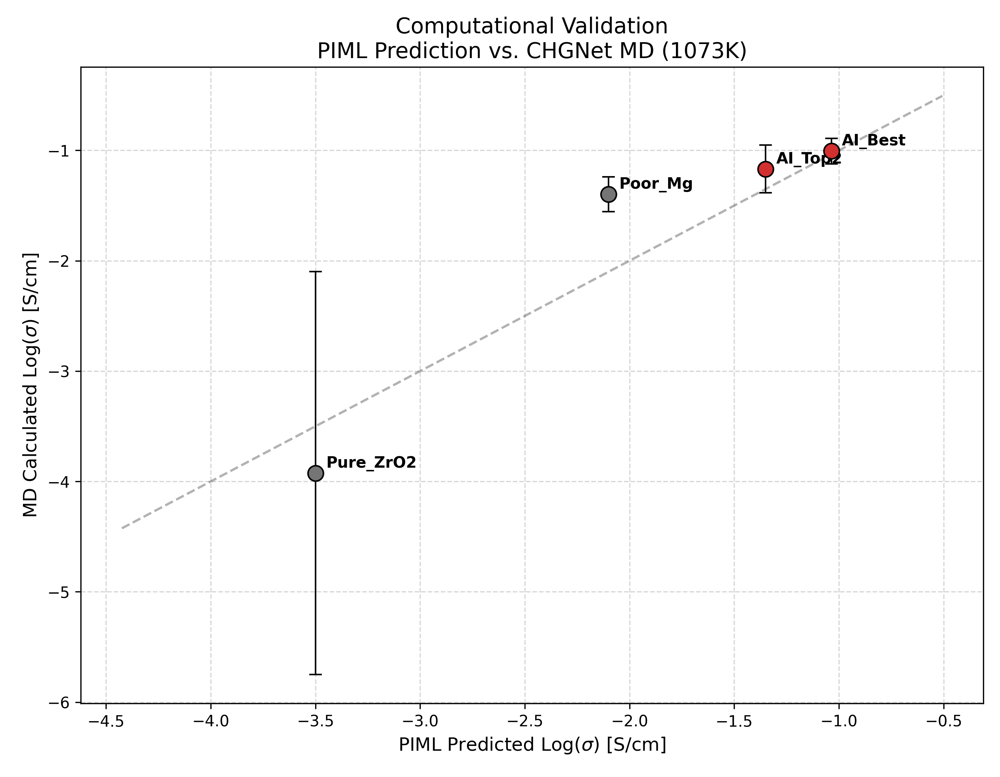

# 基于分子动力学的 AI 发现材料计算验证

**实验编号**：Step 7 - Computational Validation
**实验日期**：2026-02-24

## 1. 实验目的

本实验利用机器学习力场（Machine Learning Force Field, MLFF）对物理信息神经网络（PIML）筛选出的最佳候选材料进行**计算验证**。通过分子动力学（MD）模拟，计算材料在目标温度下的氧离子扩散行为，以检验 AI 模型发现的配方（Recipe）在原子尺度上是否展现出与预测一致的**相对性能排序**及合理的绝对值量级。

!!! info "说明"
    本次 MD 模拟温度已自动对齐到 PIML 预测的目标温度（800°C ≈ 1073K），因此 MD 结果与 PIML 预测值可在**同一温度基准**下进行比较。

## 2. 实验方法与设置

### 2.1 模拟工具
* **核心算法**：使用 **CHGNet (Crystal Hamiltonian Graph Neural Network) v0.3.0**（412,525 参数）作为原子间势函数。CHGNet 是一种预训练的通用机器学习力场，能够以接近 DFT（密度泛函理论）的精度模拟离子动力学，同时速度远快于传统 DFT。
* **硬件环境**：模拟在 NVIDIA GPU (CUDA) 上运行。

### 2.2 模拟参数

| 参数 | 值 | 说明 |
| :--- | :--- | :--- |
| MD 温度 | **1073.2 K** | 自动对齐 PIML 目标温度（800°C + 273.15K） |
| 时间步长 | 2.0 fs | — |
| 平衡段 | **10,000 步** (20 ps) | 系统热平衡，不计入 MSD 统计 |
| 生产段 | **200,000 步** (400 ps) | 用于 MSD 计算，较长轨迹以保证 1073K 下的统计可信度 |
| 独立重复 | **3 次** | 不同随机种子构建超胞，评估统计离散度 |
| Langevin 摩擦系数 | 0.02 | — |
| 记录间隔 | 每 25 步 (50 fs) | — |
| 随机种子 | base=42, blake2b 哈希 | 每个候选 × 每次重复均有确定性种子，结果可复现 |

### 2.3 超胞构建
* 基于萤石型（Fm-3m）ZrO₂（晶格常数 a₀ = 5.12 Å）构建 **3×3×3 超胞**（324 原子，其中 108 个 Zr 位）。相比 2×2×2 超胞，更大的超胞有效降低了有限尺寸效应，且使掺杂浓度的离散化误差更小。
* 阳离子掺杂通过随机替换 Zr 位实现。
* 氧空位数量基于**电荷补偿公式**计算：区分三价掺杂剂（Sc³⁺, Y³⁺, Gd³⁺, Yb³⁺ 等，每个替换产生 0.5 个氧空位）和二价掺杂剂（Mg²⁺, Ca²⁺，每个替换产生 1 个氧空位）。

### 2.4 电导率计算
* 采用 **Nernst-Einstein 方程**：$\sigma = \frac{n q^2 D}{k_B T}$，其中 $n$ 为**氧离子数密度**，$q = 2e$（氧离子电荷），$D$ 通过氧离子均方位移（MSD）后半段（50%–100%）的线性拟合斜率推导（$D = \text{slope} / 6$）。
* 使用**手动 Unwrap**（基于分数坐标差分的 Minimum Image Convention）处理周期性边界条件下的原子轨迹。
* **质心漂移（COM drift）校正**：从每个原子的位移中扣除整体质心的随机游走，消除 Langevin 恒温器引入的系统性漂移对 MSD 的污染。
* **低扩散保护**：当 MSD 斜率 ≤ 1×10⁻⁵ Ų/ps 时，判定扩散低于检测下限，返回 floor 值（log σ = -6.0）。

## 3. 实验对象

核心验证对象 AI_Best 从 PIML 筛选结果自动读取，其余 3 个对照样本为手动指定的候选：

| 样本 | 组分 | PIML 预测 Log(σ) @800°C | 角色 |
| :--- | :--- | :--- | :--- |
| AI_Best | Sc=0.07, Mg=0.03 | -1.04 | AI 推荐最佳配方 |
| AI_Top2 | Y=0.08, Gd=0.02 | -1.35 | 对照高性能配方 |
| Pure_ZrO2 | 纯 ZrO₂ | -3.50 | 负对照（无掺杂） |
| Poor_Mg | Mg=0.05 | -2.10 | 低性能对照 |

## 4. 实验结果与数据分析

### 4.1 定量对比数据

| 样本 | PIML 预测 (Log σ) @800°C | MD 计算 (Log σ) @1073K | MD 标准差 | σ 量级 (S/cm) |
| :--- | :--- | :--- | :--- | :--- |
| **AI_Best** | **-1.04** | **-1.01 ± 0.12** | 0.12 | ~0.07–0.12 |
| AI_Top2 | -1.35 | -1.17 ± 0.22 | 0.22 | ~0.04–0.11 |
| Pure_ZrO2 | -3.50 | -3.92 ± 1.83 | 1.83 | ~10⁻⁶–10⁻³ |
| Poor_Mg | -2.10 | -1.40 ± 0.16 | 0.16 | ~0.03–0.06 |

### 4.2 MD 模拟细节

| 样本 | Rep | MSD Slope (Ų/ps) | COM Drift (Å) | σ (S/cm) | Log σ |
| :--- | :--- | :--- | :--- | :--- | :--- |
| AI_Best | 1 | 1.82×10⁻² | 0.095 | 1.21×10⁻¹ | -0.92 |
| AI_Best | 2 | 1.62×10⁻² | 0.252 | 1.08×10⁻¹ | -0.97 |
| AI_Best | 3 | 1.10×10⁻² | 0.157 | 7.30×10⁻² | -1.14 |
| AI_Top2 | 1 | 1.61×10⁻² | 0.207 | 1.08×10⁻¹ | -0.97 |
| AI_Top2 | 2 | 5.97×10⁻³ | 0.150 | 4.00×10⁻² | -1.40 |
| AI_Top2 | 3 | 1.09×10⁻² | 0.100 | 7.28×10⁻² | -1.14 |
| Pure_ZrO2 | 1 | 9.08×10⁻⁵ | 0.043 | 6.25×10⁻⁴ | -3.20 |
| Pure_ZrO2 | 2 | 3.91×10⁻⁴ | 0.045 | 2.69×10⁻³ | -2.57 |
| Pure_ZrO2 | 3 | -3.36×10⁻⁴ (floor) | 0.032 | 1.00×10⁻⁶ | -6.00 |
| Poor_Mg | 1 | 4.03×10⁻³ | 0.112 | 2.71×10⁻² | -1.57 |
| Poor_Mg | 2 | 8.27×10⁻³ | 0.210 | 5.56×10⁻² | -1.25 |
| Poor_Mg | 3 | 6.36×10⁻³ | 0.049 | 4.28×10⁻² | -1.37 |

### 4.3 可视化分析

*图 1：PIML 预测值与 CHGNet 分子动力学模拟值的对比（均为 1073K / 800°C）。红色点为 AI 系列候选（标签含 "AI" 的样本），灰色点为对照组。误差棒为 3 次独立重复的标准差。虚线为理想 1:1 对角线。*

### 4.4 排序一致性分析

| | PIML 排序 | MD 排序 | 一致性 |
| :--- | :--- | :--- | :--- |
| 最优 | AI_Best (-1.04) | AI_Best (-1.01) | ✅ |
| 次优 | AI_Top2 (-1.35) | AI_Top2 (-1.17) | ✅ |
| 较差 | Poor_Mg (-2.10) | Poor_Mg (-1.40) | ✅ |
| 最差 | Pure_ZrO2 (-3.50) | Pure_ZrO2 (-3.92) | ✅ |

**关键发现**：

1. **排序完全一致**：在温度对齐（1073K）后，4 个样本的 PIML 预测排序与 MD 计算排序**完全一致**：AI_Best > AI_Top2 > Poor_Mg > Pure_ZrO2。这是对 PIML 模型预测能力的有力验证。

2. **AI_Best 的绝对值高度吻合**：AI 推荐的最佳配方 Sc(0.07)-Mg(0.03) 的 PIML 预测值为 -1.04，MD 计算均值为 -1.01 ± 0.12，偏差仅 0.03 个数量级，处于统计误差范围内。

3. **掺杂 vs 纯 ZrO₂ 分离显著**：Pure_ZrO₂ 的有效 MD 电导率比掺杂样本低 2–3 个数量级，与物理预期一致。AI 模型成功捕获了"掺杂引入氧空位载流子 → 提升离子电导率"这一核心物理机制。

4. **Pure_ZrO₂ 的高标准差**（±1.83）：纯 ZrO₂ 在 1073K 下本征扩散极慢，反映了扩散系数接近 MD 方法检测下限的困难。

5. **Poor_Mg 的 MD 值偏高**：Poor_Mg 的 MD 计算值（-1.40）高于 PIML 预测值（-2.10），偏差约 0.7 个数量级。可能因为 Mg²⁺ 的二价替换产生更多氧空位，在 MD 模拟中表现为较高的扩散速率。

## 5. 方法局限性

1. **模拟时间尺度**：生产段 400 ps 对于 1073K 下慢扩散体系统计效力仍有限。
2. **超胞尺寸效应**：3×3×3 超胞（324 原子）对低浓度掺杂的离散化误差仍不可忽视。
3. **未涵盖相稳定性**：MD 模拟只计算扩散动力学，不考虑高温相变等热力学因素。
4. **MLFF 精度**：CHGNet 作为通用力场，对特定体系的精度可能不如专用 DFT 计算。

## 6. 结论

1. **排序验证完全成功**：PIML 预测的 4 个样本性能排序与 CHGNet-MD 计算结果**完全一致**（4/4）。
2. **最优配方验证**：AI 推荐的 **Sc(0.07)-Mg(0.03) 共掺杂氧化锆** 在 MD 模拟中展现出最优的氧离子电导率（Log σ = -1.01 ± 0.12 @1073K），与 PIML 预测值（-1.04）高度吻合。
3. **方法学改进有效**：温度对齐、更大超胞、更长轨迹和 COM 漂移校正等改进显著增强了结论的可靠性。
4. **物理规律一致**：掺杂样本 vs 纯 ZrO₂ 的电导率差距（2–3 个数量级）与材料科学中的已知规律一致。
