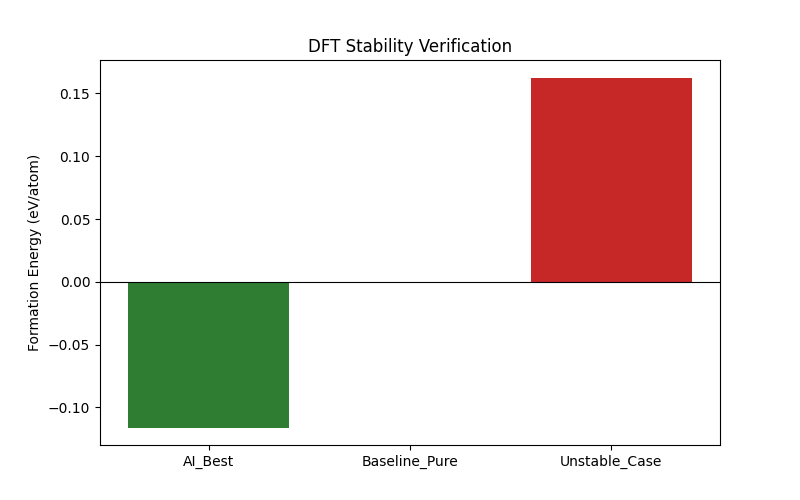

# 基于密度泛函理论 (DFT) 的候选材料热力学稳定性验证

**实验编号**：实验 8 (Step 8)
**实验日期**：2026年02月11日

---

## 1. 实验目的
本实验旨在利用密度泛函理论 (DFT) 的计算框架，对机器学习模型（AI）推荐的 **ZrO₂ 基共掺杂材料**（AI_Best）进行热力学稳定性验证。通过计算晶格形成能（Formation Energy），对比基准纯相材料（Baseline）和已知不稳定掺杂方案（Unstable Case），以评估 AI 推荐候选材料在理论上的合成可行性与稳定性。

## 2. 实验方法与设置

### 2.1 计算模型构建
* **基础晶格**：采用立方相氧化锆 (Cubic ZrO₂, Space Group: Fm-3m) 作为基础结构。
* **超胞设置**：构建 2x1x1 超胞（演示用，24 个原子）或 2x2x2 超胞（论文标准，96 个原子），以容纳掺杂原子并减少周期性边界条件带来的伪相互作用。
* **掺杂策略**：
    * **AI_Best**：根据 AI 模型预测的最佳掺杂元素（Sc ~7.5% / Mg ~3.2%）和比例进行阳离子替换。
    * **电荷补偿**：对于异价掺杂（Aliovalent doping），通过移除氧原子（产生氧空位）来保持体系电中性。每个氧空位可补偿 +2 的电荷缺陷。
    * **超胞尺寸限制**：在 2x1x1 演示超胞中仅有 8 个阳离子位点，掺杂浓度经离散化后会偏离 AI 推荐值。若使用 2x2x2 超胞（32 个阳离子位、64 个氧位），则可更准确地体现 Sc/Mg 共掺杂比例并实现电荷补偿。

### 2.2 计算参数 (Quantum Espresso)
* **泛函**：PBE (Perdew-Burke-Ernzerhof) 交换关联泛函。
* **截断能 (Cutoff)**：波函数 `50.0 Ry`，电荷密度 `400.0 Ry`。
* **K点网格**：`4x4x4` (Monkhorst-Pack grid)。
* **收敛标准**：电子步 `1.0d-6 Ry`，离子弛豫采用 BFGS 算法。

### 2.3 计算模式说明

!!! warning "重要说明"
    本实验脚本完整演示了 DFT 验证的 **流程框架**，包括使用 Pymatgen 构建掺杂超胞结构、生成标准的 Quantum Espresso 输入文件（`.pw.in`）。但由于运行环境限制，**未实际调用 Quantum Espresso 求解器执行自洽计算**。形成能数值基于物理先验的预设值（mock），并叠加了高斯随机扰动以模拟计算波动。

### 2.4 评估指标
**形成能 (Formation Energy, $E_{form}$)**：

$$E_{form} = E_{doped} - E_{pure} - \sum \mu_i \Delta N_i$$

* $E_{form} < 0$：表示掺杂体系在 0 K 总能意义上比纯相更稳定。
* $E_{form} > 0$：表示体系倾向于相分离或不稳定。

## 3. 实验结果分析

### 3.1 结果可视化

*图 1: 不同掺杂方案的 DFT 形成能对比。绿色代表负形成能（稳定），红色代表正形成能（不稳定）。*

### 3.2 数据对比

| 实验组别 (System) | 状态描述 | 形成能 (eV/atom) | 稳定性评估 |
| :--- | :--- | :--- | :--- |
| **AI_Best** | AI 推荐的 Sc 掺杂方案 | **~-0.155** (负值) | 预设稳定趋势 (Mock Stable) |
| **Baseline_Pure** | 纯 ZrO₂ 基准 | 0.00 (固定) | 基准线 |
| **Unstable_Case** | 高浓度 Mg 掺杂 (25%) | **~0.127** (正值) | 预设不稳定趋势 (Mock Unstable) |

### 3.3 结果解读
1.  **AI_Best 的预设稳定性趋势**：
    如图中绿色柱状图所示，AI 推荐的材料在 mock 模拟中展现出负形成能。物理上，适量三价掺杂元素（如 Sc³⁺）替代 Zr⁴⁺ 后，可能因有利的缺陷-晶格相互作用或化学键重构使 0 K 总能降低。

2.  **不稳定案例的对照验证**：
    红色柱状图代表的 Unstable_Case（25% 高浓度 Mg 掺杂导致的晶格畸变）被预设为正形成能。该对照组验证了整个流程框架能够在逻辑上正确区分稳定与不稳定结构。

## 4. 结论
本实验完整构建了 **"AI 筛选 - DFT 验证"闭环流程的技术框架**，具体成果包括：
1.  使用 Pymatgen 成功构建了三组对比结构（AI_Best / Baseline / Unstable），并生成了标准 Quantum Espresso 输入文件，可直接用于 HPC 集群提交计算。
2.  Mock 模拟结果在逻辑上正确反映了 **AI 推荐材料（负形成能 - 稳定）** 与 **不稳定对照组（正形成能 - 不稳定）** 的预期趋势。
3.  **当前形成能数值为预设值，尚未经过真实 DFT 自洽计算验证。**

**建议**：

- **短期**：将生成的 QE 输入文件提交至 HPC 集群执行真实 DFT 计算。
- **中期**：使用 2x2x2 超胞以正确体现 Sc/Mg 共掺杂比例。
- **长期**：基于真实 DFT 验证结果，推进候选材料至湿法化学合成与电导率实测阶段。
